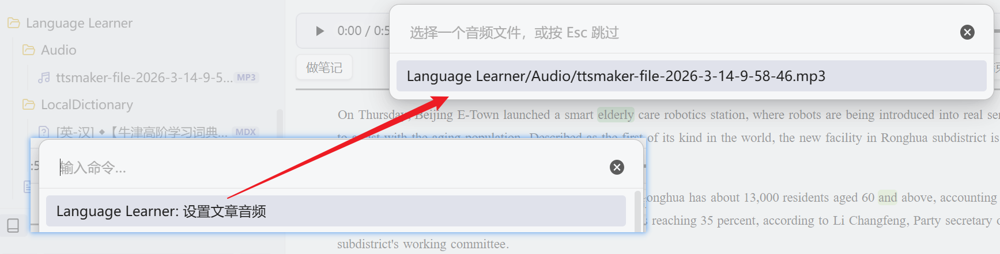
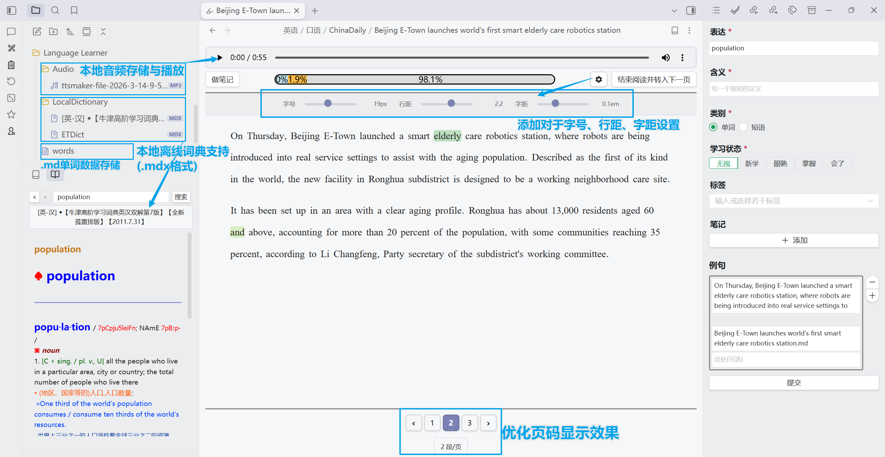
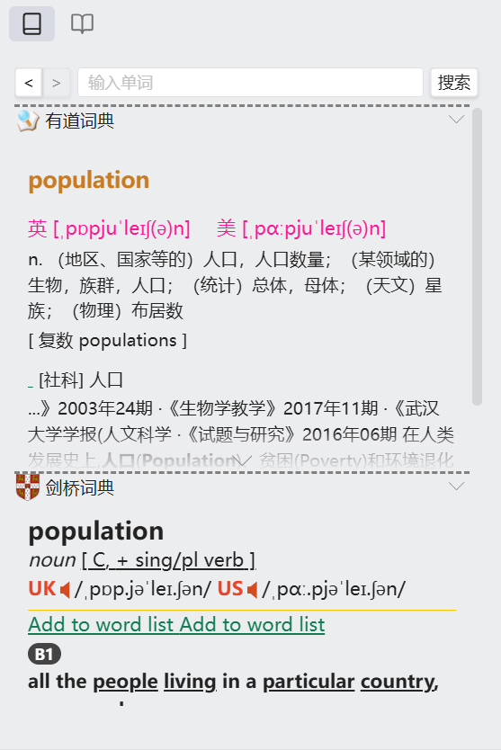
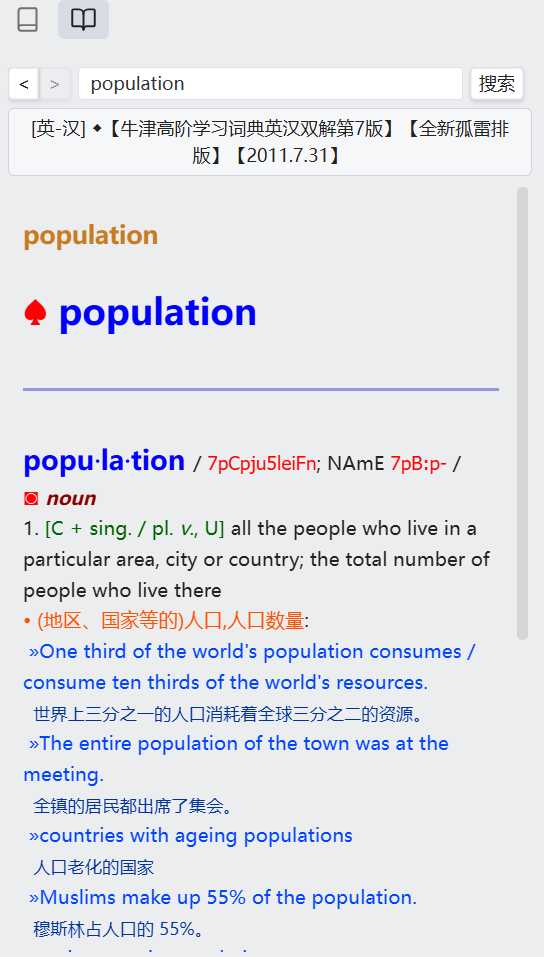

# Language Learner | 语言学习工具

[English](#english) | [中文](#中文)

---

<a name="中文"></a>

## 中文

用 Obsidian 来学习语言！

> ⚠️ **注意**：当前插件还在早期开发阶段，目前仅支持中文母语者学习英文。项目目前仅测试英文环境。本项目正在进一步开发以及维护中。

### 使用指南

- 📖 [文字教程](https://github.com/guopenghui/obsidian-language-learner/blob/master/public/tutorial.pdf)
- 🎬 [视频教程](https://www.bilibili.com/video/BV1914y1Y7mT)
- 📝 [一些做好的文本](https://github.com/guopenghui/language-learner-texts)
- 📺 @emisjerry 制作的使用教程: [Youtube](https://www.youtube.com/watch?v=lK3oFpUg7-o) | [Bilibili](https://www.bilibili.com/video/BV1N24y1k7SL/)

> 💡 感谢原作者 [@guopenghui](https://github.com/guopenghui) 提供的教程资源。

### 功能特性

#### 核心功能

- **查词功能**：直接在笔记中划词查词，支持有道词典、剑桥词典、DeepL 等多个在线词典
- **离线词典**：支持加载本地 MDict 词典文件（.mdx），无需网络即可查词
- **生词管理**：数据保存在 Obsidian 中，每个单词/短语支持多条笔记、多条例句
- **阅读模式**：将每个单词变成可点击按钮，边读边查边记笔记
- **统计图表**：显示学习进度和单词统计

#### 数据存储

- **Markdown 文件存储**（推荐）：支持 Obsidian Sync，可直接查看编辑
- **IndexedDB 本地存储**：传统存储方式
- **远程服务器存储**：支持自建后端服务器

#### 阅读模式增强

- **一键格式化**：自动为文章添加阅读模式格式标记
- **分页导航**：支持页码跳转和每页段数调整
- **本地音频**：支持在阅读模式下播放本地音频文件
- **样式设置**：可调整字号、行距、字距

#### 本地音频支持

阅读模式下支持播放本地音频文件，边听边读：

1. **格式化文章时设置**：点击侧边栏"格式化为阅读模式"按钮，会弹出音频文件选择器
2. **为已有文章设置**：打开命令面板，搜索"设置文章音频"，选择音频文件
3. **支持格式**：mp3, wav, ogg, m4a, flac, aac, wma
4. **跳过设置**：按 Esc 键可跳过不设置音频

<p align="center">
  
</p>

#### 离线词典功能

- 支持 MDX 格式词典文件
- 可同时加载多个词典
- 智能模糊匹配和单词建议
- 可设置默认词典（在线/离线）
- 目前仅支持桌面端

> ⚠️ **重要提示**：如果将词典文件复制到库目录后无法看到 .mdx 文件，或在插件选择器中找不到词典，请按以下步骤开启文件类型检测：
>
> 1. 打开 Obsidian 设置
> 2. 进入「文件与链接」
> 3. 开启「检测所有文件类型」选项
>
> 详细说明参考：[Obsidian 论坛讨论](https://forum-zh.obsidian.md/t/topic/35297)

### 界面展示

<p align="center">
  
</p>
<p align="center">
  
</p>

<p align="center">
  
</p>


### 测试通过的词典

| 序号 | 名称 | 链接 | 效果图 | 状态 |
|------|------|------|--------|------|
| 1 | [英-汉] ◆【牛津高阶学习词典英汉双解第7版】【全新孤雷排版】【2011.7.31】.mdx | [下载](https://mdx.mdict.org/%E6%8C%89%E8%AF%8D%E5%85%B8%E8%AF%AD%E7%A7%8D%E6%9D%A5%E5%88%86%E7%B1%BB/%E8%8B%B1%E8%AF%AD/%E7%B3%BB%E5%88%97%E8%AF%8D%E5%85%B8/%E7%89%9B%E6%B4%A5/%5B%E8%8B%B1-%E6%B1%89%5D%20%E2%97%86%E3%80%90%E7%89%9B%E6%B4%A5%E9%AB%98%E9%98%B6%E5%AD%A6%E4%B9%A0%E8%AF%8D%E5%85%B8%E8%8B%B1%E6%B1%89%E5%8F%8C%E8%A7%A3%E7%AC%AC7%E7%89%88%E3%80%91%E3%80%90%E5%85%A8%E6%96%B0%E5%AD%A4%E9%9B%B7%E6%8E%92%E7%89%88%E3%80%91%E3%80%902011.7.31%E3%80%91.mdx) |  | ✅ 通过 |
| 2 | [英-汉] 【2012.7.1】牛津高阶学习词典英汉双解第7版【OALD 8风格重新排版】.mdx | [下载](https://mdx.mdict.org/%E6%8C%89%E8%AF%8D%E5%85%B8%E8%AF%AD%E7%A7%8D%E6%9D%A5%E5%88%86%E7%B1%BB/%E8%8B%B1%E8%AF%AD/%E7%B3%BB%E5%88%97%E8%AF%8D%E5%85%B8/%E7%89%9B%E6%B4%A5/%5B%E8%8B%B1-%E6%B1%89%5D%20%E3%80%902012.7.1%E3%80%91%E7%89%9B%E6%B4%A5%E9%AB%98%E9%98%B6%E5%AD%A6%E4%B9%A0%E8%AF%8D%E5%85%B8%E8%8B%B1%E6%B1%89%E5%8F%8C%E8%A7%A3%E7%AC%AC7%E7%89%88%E3%80%90OALD%208%E9%A3%8E%E6%A0%BC%E9%87%8D%E6%96%B0%E6%8E%92%E7%89%88%E3%80%91.mdx) |  | ✅ 通过 |

> 更多词典可在 [mdx.mdict.org](https://mdx.mdict.org/%E6%8C%89%E8%AF%8D%E5%85%B8%E8%AF%AD%E7%A7%8D%E6%9D%A5%E5%88%86%E7%B1%BB/%E8%8B%B1%E8%AF%AD/%E6%99%AE%E9%80%9A%E8%AF%8D%E5%85%B8/) 获取

### 安装

1. 从 Release 下载压缩包
2. 解压到 `.obsidian/plugins/obsidian-language-learner/` 目录
3. 在 Obsidian 设置中启用插件
4. 配置词典和存储方式

### 自行构建

```bash
# 克隆仓库
git clone https://github.com/guopenghui/obsidian-language-learner.git

# 进入目录
cd obsidian-language-learner

# 安装依赖
npm install

# 构建
npm run build
```

---

<a name="english"></a>

## English

Learn languages with Obsidian!

> ⚠️ **Note**: The plugin is in early development stage. Currently only supports Chinese native speakers learning English. The project has only been tested in English environment. This project is under active development and maintenance.

### Tutorials

- 📖 [Text Tutorial (PDF, Chinese)](https://github.com/guopenghui/obsidian-language-learner/blob/master/public/tutorial.pdf)
- 🎬 [Video Tutorial (Bilibili, Chinese)](https://www.bilibili.com/video/BV1914y1Y7mT)
- 📝 [Sample Texts](https://github.com/guopenghui/language-learner-texts)
- 📺 Tutorial by @emisjerry: [Youtube](https://www.youtube.com/watch?v=lK3oFpUg7-o) | [Bilibili](https://www.bilibili.com/video/BV1N24y1k7SL/)

> 💡 Thanks to the original author [@guopenghui](https://github.com/guopenghui) for providing these tutorial resources.

### Features

#### Core Features

- **Word Lookup**: Select text to search in multiple online dictionaries (Youdao, Cambridge, DeepL, etc.)
- **Offline Dictionary**: Load local MDict dictionary files (.mdx) for offline word lookup
- **Vocabulary Management**: Store words in Obsidian, each word/phrase supports multiple notes and sentences
- **Reading Mode**: Convert each word into a clickable button for easy lookup while reading
- **Statistics**: Display learning progress and word counts

#### Data Storage

- **Markdown File Storage** (Recommended): Supports Obsidian Sync, directly viewable and editable
- **IndexedDB Local Storage**: Traditional storage method
- **Remote Server Storage**: Self-hosted backend server support

#### Reading Mode Enhancements

- **One-click Formatting**: Automatically add reading mode format markers
- **Pagination**: Page navigation with adjustable paragraphs per page
- **Local Audio**: Play local audio files in reading mode
- **Style Settings**: Adjust font size, line height, and letter spacing

#### Local Audio Support

Play local audio files while reading:

1. **Set during formatting**: Click "Format for Reading" button, an audio file selector will appear
2. **Set for existing articles**: Open command palette, search "Set Article Audio", select audio file
3. **Supported formats**: mp3, wav, ogg, m4a, flac, aac, wma
4. **Skip setting**: Press Esc to skip audio selection

<!-- Insert image: Audio player interface -->


#### Offline Dictionary Features

- Support MDX format dictionary files
- Load multiple dictionaries simultaneously
- Smart fuzzy matching and word suggestions
- Configurable default dictionary (online/offline)
- Currently desktop only

> ⚠️ **Important**: If you cannot see .mdx files after copying them to your vault, or cannot find dictionaries in the plugin selector, please enable file type detection:
>
> 1. Open Obsidian Settings
> 2. Go to "Files & Links"
> 3. Enable "Detect all file extensions" option
>
> See [Obsidian Forum](https://forum-zh.obsidian.md/t/topic/35297) for details.

### Screenshots

<p align="center">
  
</p>
<p align="center">
  
</p>

<p align="center">
  
</p>


### Tested Dictionaries

| No. | Name | Link | Screenshot | Status |
|-----|------|------|------------|--------|
| 1 | [En-Zh] Oxford Advanced Learner's Dictionary 7th Edition (Bilingual) | [Download](https://mdx.mdict.org/%E6%8C%89%E8%AF%8D%E5%85%B8%E8%AF%AD%E7%A7%8D%E6%9D%A5%E5%88%86%E7%B1%BB/%E8%8B%B1%E8%AF%AD/%E7%B3%BB%E5%88%97%E8%AF%8D%E5%85%B8/%E7%89%9B%E6%B4%A5/%5B%E8%8B%B1-%E6%B1%89%5D%20%E2%97%86%E3%80%90%E7%89%9B%E6%B4%A5%E9%AB%98%E9%98%B6%E5%AD%A6%E4%B9%A0%E8%AF%8D%E5%85%B8%E8%8B%B1%E6%B1%89%E5%8F%8C%E8%A7%A3%E7%AC%AC7%E7%89%88%E3%80%91%E3%80%90%E5%85%A8%E6%96%B0%E5%AD%A4%E9%9B%B7%E6%8E%92%E7%89%88%E3%80%91%E3%80%902011.7.31%E3%80%91.mdx) |  | ✅ Passed |
| 2 | [En-Zh] Oxford Advanced Learner's Dictionary 7th Edition (OALD 8 Style) | [Download](https://mdx.mdict.org/%E6%8C%89%E8%AF%8D%E5%85%B8%E8%AF%AD%E7%A7%8D%E6%9D%A5%E5%88%86%E7%B1%BB/%E8%8B%B1%E8%AF%AD/%E7%B3%BB%E5%88%97%E8%AF%8D%E5%85%B8/%E7%89%9B%E6%B4%A5/%5B%E8%8B%B1-%E6%B1%89%5D%20%E3%80%902012.7.1%E3%80%91%E7%89%9B%E6%B4%A5%E9%AB%98%E9%98%B6%E5%AD%A6%E4%B9%A0%E8%AF%8D%E5%85%B8%E8%8B%B1%E6%B1%89%E5%8F%8C%E8%A7%A3%E7%AC%AC7%E7%89%88%E3%80%90OALD%208%E9%A3%8E%E6%A0%BC%E9%87%8D%E6%96%B0%E6%8E%92%E7%89%88%E3%80%91.mdx) |  | ✅ Passed |

> More dictionaries available at [mdx.mdict.org](https://mdx.mdict.org/%E6%8C%89%E8%AF%8D%E5%85%B8%E8%AF%AD%E7%A7%8D%E6%9D%A5%E5%88%86%E7%B1%BB/%E8%8B%B1%E8%AF%AD/%E6%99%AE%E9%80%9A%E8%AF%8D%E5%85%B8/)

### Installation

1. Download the release package
2. Extract to `.obsidian/plugins/obsidian-language-learner/` directory
3. Enable the plugin in Obsidian settings
4. Configure dictionaries and storage options

### Build from Source

```bash
# Clone the repository
git clone https://github.com/guopenghui/obsidian-language-learner.git

# Navigate to directory
cd obsidian-language-learner

# Install dependencies
npm install

# Build
npm run build
```

---

## Acknowledgments | 致谢

本项目基于以下开源项目开发：

### Core Projects | 核心项目

- [obsidian-language-learner](https://github.com/guopenghui/obsidian-language-learner) - Original plugin by @guopenghui
- [js-mdict](https://github.com/terasum/js-mdict) - MDict (.mdx/.mdd) file parser by @terasum

### Frameworks & Libraries | 框架与库

- [Obsidian](https://obsidian.md/) - The note-taking app
- [Vue 3](https://vuejs.org/) - Progressive JavaScript framework
- [Naive UI](https://www.naiveui.com/) - Vue 3 component library
- [Dexie.js](https://dexie.org/) - IndexedDB wrapper
- [ECharts](https://echarts.apache.org/) - Charting library
- [unified](https://unifiedjs.com/) - Text processing ecosystem

### Special Thanks | 特别感谢

- [@guopenghui](https://github.com/guopenghui) - 原插件作者
- [@terasum](https://github.com/terasum) - js-mdict 项目作者
- [Claude Code](https://claude.ai/code) - AI 编程助手
- [glm-5](https://bigmodel.cn/) - 智谱 AI 大模型
- All dictionary providers and the MDict community
- Everyone who contributed to this project

---

## License | 许可证

MIT License